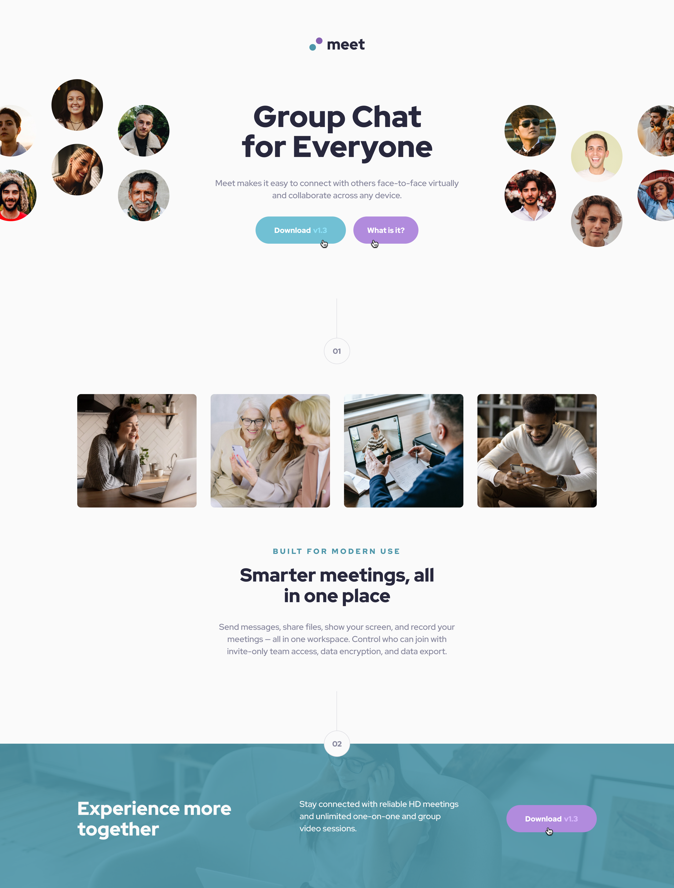

# **Meet Landing Page - ReadMe**

A meet up landing page built with HMTL and CSS

## Table of Contents
1. Introduction
2. Requirements
3. Installation

## 1. Introduction

This project is a simple one-page static website built with HTML and CSS.

## 2. Requirements

To run and customize this project, you need the following:

- A code editor (e.g., Visual Studio Code, Sublime Text)
- A web browser (e.g., Google Chrome, Mozilla Firefox)

## 3. Installation

1. Clone the repository or download the ZIP file.
2. Extract the contents to a directory on your local machine.
